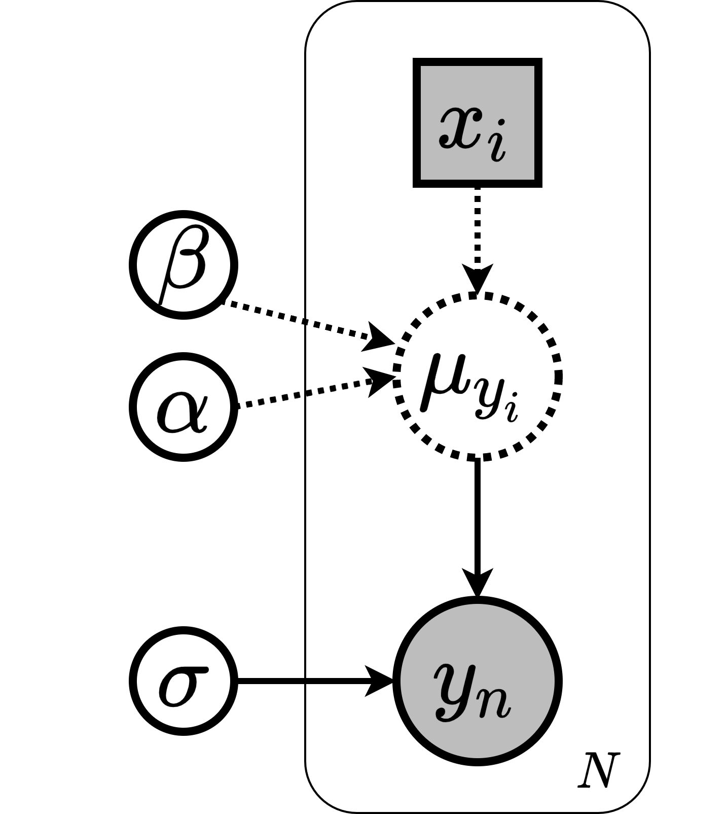
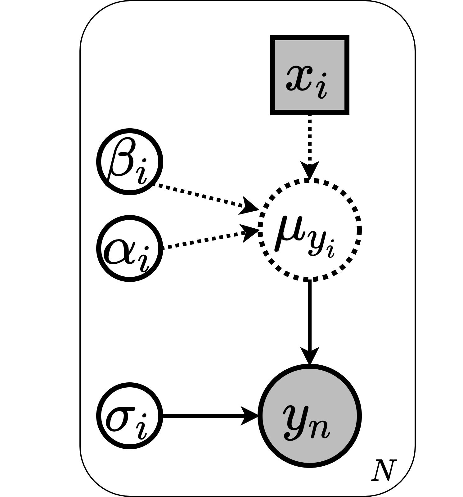
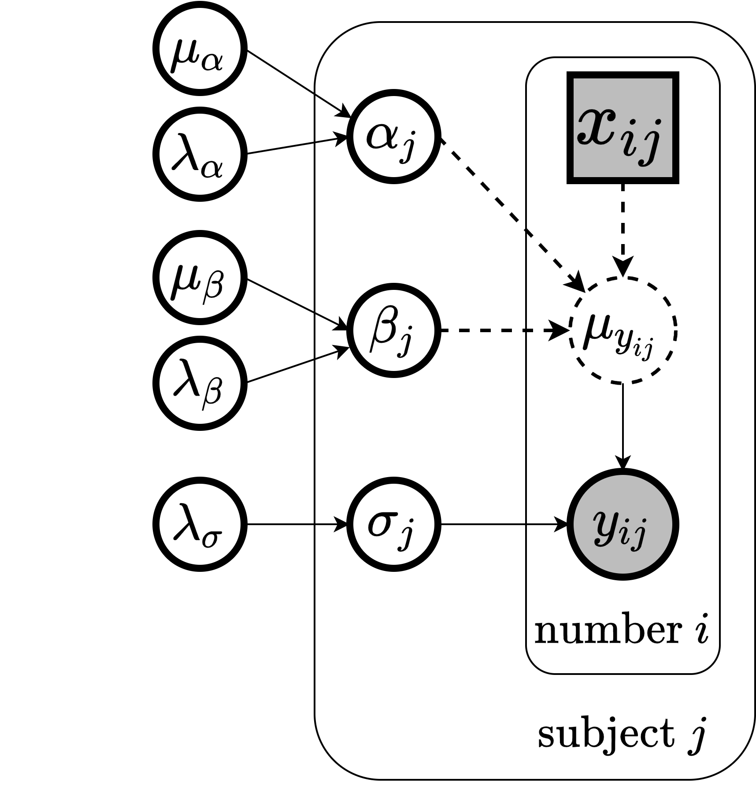

# Hierarchical vs. Pooled Bayesian Regression

This repository contains the materials for a term project completed for ELG5218 "Uncertainty Evaluation in Engineering Measurements and Machine Learning" (Winter 2022), taught by [Prof. Miodrag Bolic](http://www.site.uottawa.ca/~mbolic) at the University of Ottawa.

Course GitHub Repository: [Health-Devices/Course-Uncertanty-Machine-Learning-2021](https://github.com/Health-Devices/Course-Uncertanty-Machine-Learning-2021)

## Project Overview

This project explores and compares different Bayesian regression models for predicting blood pressure from Pulse Arrival Time (PAT) measurements:

- **Pooled Model**: Assumes all observations have the same parameters (θ), ignoring group information
- **Separate Model**: Assumes personalized parameters for each observation
- **Hierarchical Model**: Assumes different parameters for observations of each group, while all parameters are sampled from a common distribution

## Repository Contents

- Jupyter notebook with Julia code implementation of the models
- Slides explaining the theoretical background and results
- Three key model diagrams (displayed below):
  - `h_model_all.png` - Hierarchical model diagram
  - `p_model.png` - Pooled model diagram
  - `separate_lr.png` - Separate model diagram

## Model Diagrams

<div align="center">
<p><strong>Pooled Model</strong></p>

&nbsp;&nbsp;
<p><strong>Separate Model</strong></p>

&nbsp;&nbsp;
<p><strong>Hierarchical Model</strong></p>

</div>

## Key Findings

- The hierarchical model provides a better fit for the training data, learning different parameters (α, β, σ) for different subjects
- The pooled model is too constrained to capture individual differences between subjects
- Posterior Predictive Checks (PPC) and Highest Density Intervals (HDI) show the hierarchical model's superior fit on training data
- However, for new subjects (test data), the hierarchical model's predictions have high uncertainty
- As the number of data points per subject increases, the hierarchical model better distinguishes between subjects

## Use Case

This work demonstrates blood pressure prediction using PAT measurements, with the relationship:

```
BP = α + β * ln(PAT) + ε
```

The dataset contains multiple PAT and BP readings from 10 subjects, showcasing how personalized Bayesian models can improve predictions for individual subjects.

## Metrics Used

The models were evaluated using:
- WAIC (Widely Applicable Information Criterion)
- LOO (Leave-One-Out cross-validation)
- MAE (Mean Absolute Error) on both training and test data
